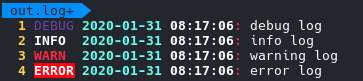

# CppLog
A very simple header only logging implementation with coloured output and log to file support.

## Settings
Changing file path, log level, colours or disabling file logging can be done in the header file. 

## Samples
### Terminal output:

### Log file content
  
NOTE: Colours come from vim's default syntax highlighting.
